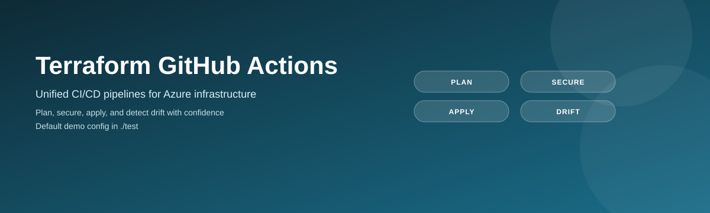
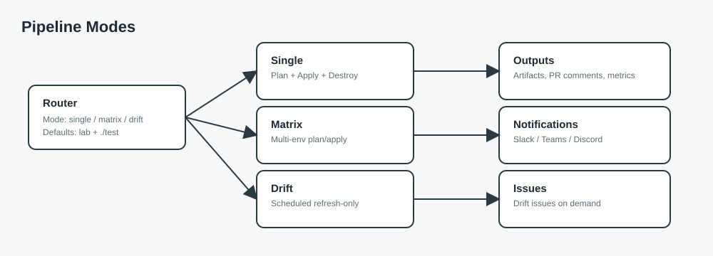
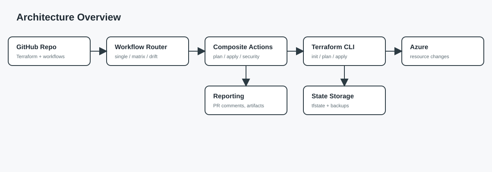
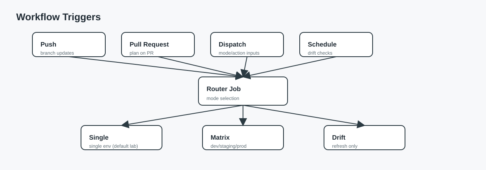
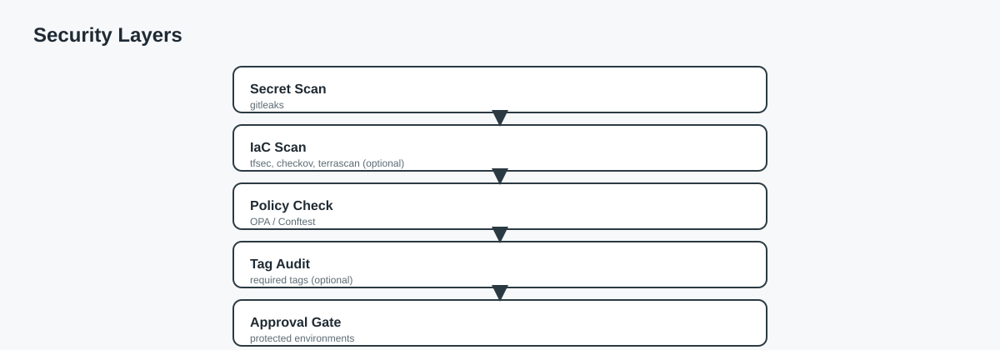
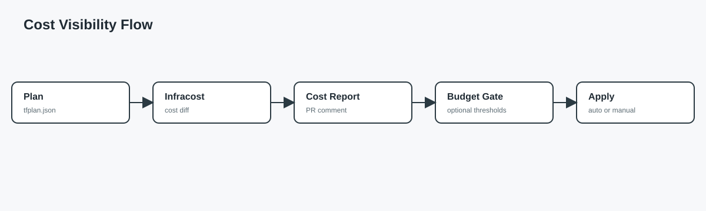
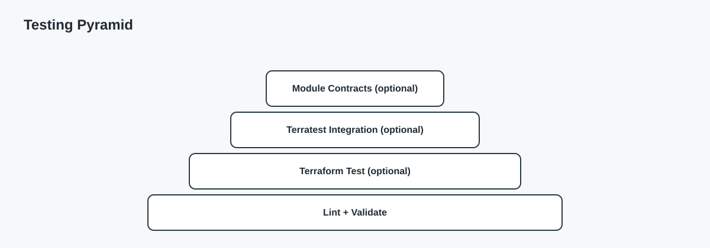
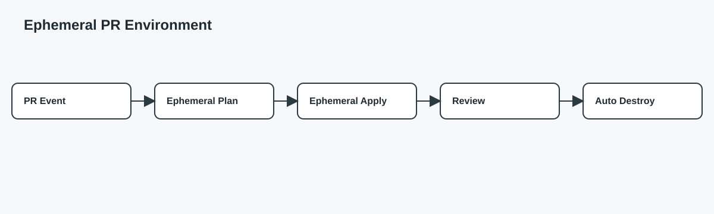
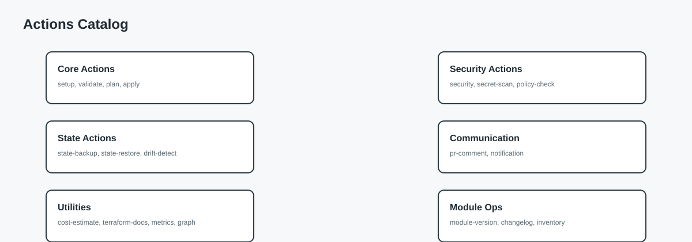
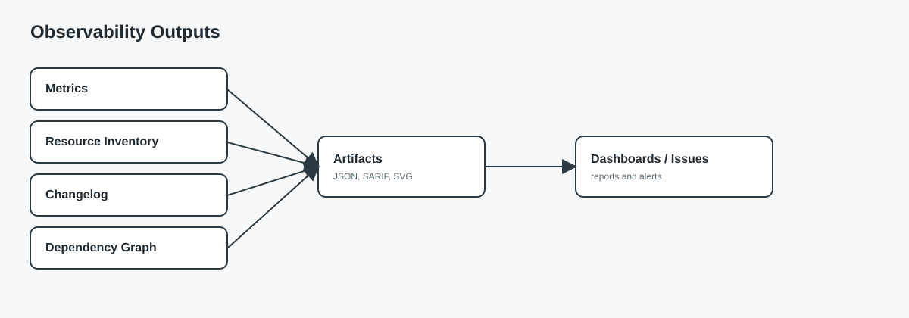

# 🚀 Terraform GitHub Actions

[](https://www.terraform.io/)
[](https://opensource.org/licenses/MIT)
[](https://github.com/features/actions)

<p align="center">
  
</p>

<p align="center">
  
</p>

Reusable GitHub Actions for Terraform workflows. Includes plan, apply, validate, security scanning, cost estimation, and more. Automate your infrastructure deployments with production-ready CI/CD pipelines.

---

## 📋 Table of Contents

- [Features](#-features)
- [Quick Start](#-quick-start)
- [Documentation](#-documentation)
- [Diagram Gallery](#diagram-gallery)
- [Actions Reference](#-actions-reference)
- [Workflow Example](#-workflow-example)
- [Pipeline Stages](#-pipeline-stages)
- [Configuration](#️-configuration)
- [Cost Estimation](#-cost-estimation)
- [Security Scanning](#-security-scanning)
- [Troubleshooting](#-troubleshooting)
- [Project Structure](#-project-structure)
- [License](#-license)
- [Acknowledgments](#-acknowledgments)

---

## ✨ Features

| Feature | Description |
|---------|-------------|
| **� OIDC Authentication** | Secure Azure authentication without long-lived secrets |
| **🔄 Plan & Apply** | Safe infrastructure changes with plan review and approval gates |
| **🔒 Security Scanning** | Integrated tfsec, Checkov, and TFLint for compliance |
| **💰 Cost Estimation** | Infracost integration for cost visibility |
| **📊 Metrics & Reporting** | Resource inventory, change logs, and dependency graphs |
| **🧪 Testing** | Terratest integration for infrastructure testing |
| **🔍 Drift Detection** | Scheduled detection of infrastructure drift |
| **🔐 Secret Scanning** | Detect hardcoded secrets before deployment |
| **📝 Documentation** | Auto-generate terraform-docs |
| **💾 State Backup & Restore** | Automated state file backups with restore capability |
| **💬 PR Comments** | Automatic plan/cost/security summaries on pull requests |
| **📢 Notifications** | Slack, Teams, Discord integration |
| **🏷️ Module Versioning** | Semantic versioning for modules |
| **🚨 Policy Checks** | OPA/Sentinel policy validation |
| **⚡ Plugin Caching** | Faster builds with Terraform plugin caching |

---

## 🚀 Quick Start

### 1. Copy the Actions to Your Repository

```bash
# Clone this repository
git clone https://github.com/Jamonygr/terraform-github-actions.git

# Copy the .github folder to your Terraform project
cp -r terraform-github-actions/.github your-terraform-project/
```

### 2. Set Up Authentication

#### Option A: OIDC (Recommended) 🔐

Add these **Variables** to your GitHub repository:

| Variable | Description | Required |
|----------|-------------|----------|
| `AZURE_CLIENT_ID` | Azure AD Application (Client) ID | ✅ Yes |
| `AZURE_TENANT_ID` | Azure AD Tenant ID | ✅ Yes |
| `AZURE_SUBSCRIPTION_ID` | Azure Subscription ID | ✅ Yes |
| `USE_OIDC` | Set to `true` | ✅ Yes |

Add these **Secrets**:

| Secret | Description | Required |
|--------|-------------|----------|
| `TF_STATE_RG` | Terraform state resource group | ✅ Yes |
| `TF_STATE_SA` | Terraform state storage account | ✅ Yes |
| `INFRACOST_API_KEY` | Infracost API key | ❌ Optional |

See [SETUP.md](.github/SETUP.md) for detailed OIDC configuration instructions.

#### Option B: Service Principal (Legacy)

Add these **Secrets** to your GitHub repository:

| Secret | Description | Required |
|--------|-------------|----------|
| `AZURE_CREDENTIALS` | Azure service principal JSON | ✅ Yes |
| `TF_STATE_RG` | Terraform state resource group | ✅ Yes |
| `TF_STATE_SA` | Terraform state storage account | ✅ Yes |
| `INFRACOST_API_KEY` | Infracost API key | ❌ Optional |

### 3. Trigger the Workflow

```bash
# Push changes to trigger the pipeline
git add .
git commit -m "Add Terraform GitHub Actions"
git push
```

---

## 📚 Documentation

Full documentation is available in the repo wiki folder. Start here:

- [Wiki Home](wiki/Home.md)
- [Getting Started](wiki/Getting-Started.md)
- [Workflow Modes](wiki/Workflow-Modes.md)
- [Pipeline Stages](wiki/Pipeline-Stages.md)
- [Actions Reference](wiki/Actions-Reference.md)

## Diagram Gallery






















---

## 📦 Actions Reference

### Core Actions

| Action | Description | Key Inputs |
|--------|-------------|------------|
| [**setup**](.github/actions/setup/) | Shared Terraform setup with caching | `terraform_version`, `use_oidc` |
| [**validate**](.github/actions/validate/) | Terraform format and validate | `working_directory` |
| [**plan**](.github/actions/plan/) | Initialize and create execution plan | `use_oidc`, `var_file`, `state_key` |
| [**apply**](.github/actions/apply/) | Apply Terraform changes | `use_oidc`, `plan_artifact` |
| [**destroy**](.github/actions/destroy/) | Destroy infrastructure | `use_oidc`, `confirm: DESTROY` |

### Security Actions

| Action | Description | Tools Used |
|--------|-------------|------------|
| [**security**](.github/actions/security/) | Security scanning | tfsec, Checkov, TFLint |
| [**secret-scan**](.github/actions/secret-scan/) | Detect hardcoded secrets | Gitleaks with SARIF upload |
| [**policy-check**](.github/actions/policy-check/) | Policy validation | OPA, Conftest |

### State Management Actions

| Action | Description | Key Features |
|--------|-------------|--------------|
| [**state-backup**](.github/actions/state-backup/) | Backup state files | Auto-cleanup, retention policy |
| [**state-restore**](.github/actions/state-restore/) | Restore from backup | List backups, confirm required |
| [**drift-detect**](.github/actions/drift-detect/) | Detect infrastructure drift | Auto-create issues |

### Communication Actions

| Action | Description | Supported |
|--------|-------------|-----------|
| [**pr-comment**](.github/actions/pr-comment/) | Post summaries to PRs | Plan, cost, security |
| [**notification**](.github/actions/notification/) | Send notifications | Slack, Teams, Discord |

### Utility Actions

| Action | Description | Output |
|--------|-------------|--------|
| [**cost-estimate**](.github/actions/cost-estimate/) | Infrastructure cost estimation | Monthly cost, cost diff |
| [**terraform-docs**](.github/actions/terraform-docs/) | Generate documentation | README updates |
| [**graph**](.github/actions/graph/) | Dependency visualization | SVG/PNG graph |
| [**resource-inventory**](.github/actions/resource-inventory/) | List managed resources | Resource report |
| [**changelog**](.github/actions/changelog/) | Generate change log | CHANGELOG.md |
| [**metrics**](.github/actions/metrics/) | Pipeline metrics | Duration, resource counts |
| [**module-version**](.github/actions/module-version/) | Module versioning | Versions JSON, update check |
| [**terratest**](.github/actions/terratest/) | Infrastructure testing | Test results |

---

## 📝 Workflow Example

### Basic Workflow

```yaml
name: 'Terraform'

on:
  push:
    branches: [main]
  pull_request:
    branches: [main]
  workflow_dispatch:
    inputs:
      action:
        type: choice
        options: [plan, apply, destroy]
        default: 'plan'

jobs:
  terraform:
    runs-on: ubuntu-latest
    steps:
      - uses: actions/checkout@v4

      - name: Validate
        uses: ./.github/actions/validate

      - name: Security Scan
        uses: ./.github/actions/security

      - name: Plan
        uses: ./.github/actions/plan
        with:
          azure_credentials: ${{ secrets.AZURE_CREDENTIALS }}
          backend_resource_group: ${{ secrets.TF_STATE_RG }}
          backend_storage_account: ${{ secrets.TF_STATE_SA }}
          state_key: 'myproject.tfstate'
          var_file: 'environments/lab.tfvars'
          environment: 'lab'

      - name: Cost Estimate
        uses: ./.github/actions/cost-estimate
        with:
          api_key: ${{ secrets.INFRACOST_API_KEY }}
          var_file: 'environments/lab.tfvars'
```

---

## 🔄 Pipeline Stages

The unified workflow (`terraform.yml`) supports single, matrix, and drift modes. High-level view:


### Stage Details

| Stage | Job(s) | Purpose | Notes |
|-------|--------|---------|-------|
| 0 | `router` | Select mode (single, matrix, drift) | `repo-hygiene` optional |
| 1 | `format` | Enforce `terraform fmt` | Blocking |
| 2 | `validate` | Validate configuration | Blocking |
| 3 | Security suite | tfsec, Checkov, secret scan, ShellCheck | Terrascan optional |
| 4 | Lint and policy | TFLint, policy checks, terraform-docs | Docs check optional |
| 5 | Analysis | Graph + module versions | Always on |
| 6 | Cost and versions | Infracost + provider checks | Cost is single mode only |
| 7 | `plan` | Plan + PR comment + blast radius | Single mode only |
| 8 | `apply` | Manual apply | Environment gates |
| 9 | `destroy` | Manual destroy + confirm | Environment gates |
| 10 | `metrics` | Post-apply reporting | Single mode only |

Optional post-plan actions include tag audit, Terratest PR integration tests, ephemeral PR environments, and canary apply. Many stages are gated by mode, event, or repo variables, so plan-only runs will show skipped jobs. See [Pipeline Stages](wiki/Pipeline-Stages.md) for the full list and mode-specific jobs (matrix and drift).

---
## ⚙️ Configuration

### Workflow Inputs

| Input | Description | Default | Options |
|-------|-------------|---------|---------|
| `mode` | Pipeline mode | `single` | `single`, `matrix`, `drift` |
| `environment` | Target environment (single mode) | `lab` | `dev`, `lab`, `staging`, `prod` |
| `environments` | Target environments (matrix mode) | `dev,staging,prod` | Comma-separated list |
| `action` | Pipeline action | `plan` | `plan`, `apply`, `destroy` |
| `destroy_confirm` | Destruction confirmation | - | Type `DESTROY` |
| `working_directory` | Terraform working directory | `./test` | Any relative path |
| `create_drift_issue` | Create GitHub issue on drift | `true` | `true`, `false` |

Note: this repository ships a minimal Terraform config in `./test`, so the workflow defaults to `./test`. Set `working_directory` to `.` or your own path (or set `TF_WORKING_DIRECTORY`) when using your own Terraform layout.

### Environment Variables

```yaml
env:
  TF_VERSION: '1.9.0'          # Terraform version
  ENVIRONMENT: 'lab'            # Default environment
  WORKING_DIRECTORY: './test'   # Default for this repo; override as needed
```

### Optional Repository Variables

| Variable Name | Description |
|--------------|-------------|
| `TF_WORKING_DIRECTORY` | Default Terraform working directory (e.g., `./test`) |
| `ENABLE_TERRAFORM_TESTS` | Set to `false` to disable `terraform test` stage |
| `ENABLE_MODULE_CONTRACTS` | Enable module contract checks for `modules/` |
| `FAIL_ON_MODULE_CONTRACTS` | Fail pipeline when contract checks find issues |
| `DOCS_ENFORCE` | Enforce terraform-docs check (fail on diff) |
| `ENABLE_TERRASCAN` | Enable Terrascan security scan |
| `TERRASCAN_VERSION` | Override Terrascan version (default `1.18.3`) |
| `REQUIRED_TAG_KEYS` | Comma-separated required tag keys for tag audit |
| `FAIL_ON_TAG_AUDIT` | Fail pipeline when tag audit finds missing tags |
| `ENABLE_CANARY` | Enable canary apply before prod |
| `CANARY_ENVIRONMENT` | Environment name for canary (e.g., `canary`) |
| `CANARY_VAR_FILE` | Var file for canary (default `environments/<env>.tfvars`) |
| `CANARY_STATE_KEY` | State key for canary (default `<env>.terraform.tfstate`) |
| `ENABLE_EPHEMERAL_ENV` | Enable ephemeral PR environment (apply + destroy) |
| `EPHEMERAL_VAR_FILE` | Var file for ephemeral PR environment |
| `ENABLE_REPO_HYGIENE` | Enable repo hygiene checks (branch protection) |
| `FAIL_ON_REPO_HYGIENE` | Fail pipeline if hygiene checks fail |

Additional optional variables (health checks, dependency checks, quotas, SBOM, auto-rollback, etc.) are documented in [Pipeline Stages](wiki/Pipeline-Stages.md).

### Concurrency Control

```yaml
concurrency:
  group: terraform-${{ github.ref }}-${{ inputs.environment || github.event.inputs.environment || github.event.inputs.mode || 'default' }}
  cancel-in-progress: false     # Never cancel in-progress runs
```

---

## 💰 Cost Estimation

The pipeline integrates with [Infracost](https://www.infracost.io/) for cost visibility.

### Setup

1. Get a free API key from [Infracost](https://www.infracost.io/pricing/)
2. Add `INFRACOST_API_KEY` to your repository secrets

### Sample Output

```
💰 Cost Estimation

Project: azure-landing-zone
Currency: USD

Monthly Cost: $547.42
├── Azure Firewall:     $350.40
├── VPN Gateway:        $138.70
├── Virtual Machines:    $45.00
├── Load Balancer:       $18.32
└── Storage:              $5.00

Cost Change: +$25.00 (+4.8%)
```

---

## 🔒 Security Scanning

### Tools Integrated

| Tool | Purpose | Checks |
|------|---------|--------|
| **tfsec** | Static analysis | 100+ security rules |
| **Checkov** | Compliance scanning | CIS, SOC2, HIPAA, PCI-DSS |
| **TFLint** | Linting | Best practices, errors |
| **gitleaks** | Secret detection | API keys, passwords |

### Security Best Practices

| Practice | Implementation |
|----------|----------------|
| **No hardcoded secrets** | Use `sensitive = true` and Key Vault |
| **Encryption at rest** | Enable storage encryption |
| **Network security** | NSGs, private endpoints |
| **Least privilege** | Minimal IAM permissions |
| **State protection** | Encrypted backend storage |

---

## 🔧 Troubleshooting

### Common Issues & Solutions

#### Pipeline Fails at Format Check

```bash
# Fix formatting locally
terraform fmt -recursive

# Commit the changes
git add .
git commit -m "Fix: terraform formatting"
git push
```

#### Authentication Failed

```bash
# Verify Azure credentials
az login --service-principal \
  --username $ARM_CLIENT_ID \
  --password $ARM_CLIENT_SECRET \
  --tenant $ARM_TENANT_ID

# Check the credentials JSON format
{
  "clientId": "xxx",
  "clientSecret": "xxx",
  "subscriptionId": "xxx",
  "tenantId": "xxx"
}
```

#### State Lock Error

```bash
# Force unlock (use carefully!)
terraform force-unlock <LOCK_ID>
```

#### Variables File Not Found

- Ensure `working_directory` points to your Terraform configuration (this repo defaults to `./test`).
- Ensure `var_file` paths are relative to the working directory.

#### Security Scan Fails

Security scans use `soft_fail: true` by default. To block on failures:

```yaml
- name: Security Scan
  uses: ./.github/actions/security
  with:
    soft_fail: false  # Block on security issues
```

### Terraform Timing Reference

| Operation | Typical Duration |
|-----------|------------------|
| Format Check | ~10 seconds |
| Validate | ~30 seconds |
| Security Scans | ~1-2 minutes |
| Plan (small) | ~1-3 minutes |
| Plan (large) | ~5-10 minutes |
| Apply | Varies by resources |

---

## 📁 Project Structure

```
terraform-github-actions/
├── .github/
│   ├── workflows/
│   │   └── terraform.yml      # Main pipeline workflow
│   │
│   ├── actions/               # Reusable composite actions
│   │   ├── apply/             # Terraform apply
│   │   ├── changelog/         # Generate changelogs
│   │   ├── cost-estimate/     # Infracost integration
│   │   ├── destroy/           # Terraform destroy
│   │   ├── graph/             # Dependency visualization
│   │   ├── metrics/           # Pipeline metrics
│   │   ├── module-version/    # Semantic versioning
│   │   ├── plan/              # Terraform plan
│   │   ├── policy-check/      # OPA/Sentinel policies
│   │   ├── resource-inventory/# Resource listing
│   │   ├── secret-scan/       # Secret detection
│   │   ├── security/          # Security scanning
│   │   ├── state-backup/      # State file backup
│   │   ├── terraform-docs/    # Documentation generation
│   │   ├── terratest/         # Infrastructure testing
│   │   └── validate/          # Format & validate
│   │
│   └── SETUP.md               # Detailed setup guide
│
├── wiki/                     # Documentation wiki
│   ├── Home.md                # Wiki landing page
│   ├── Pipeline-Stages.md     # Stage-by-stage details
│   ├── Actions-Reference.md   # Actions catalog
│   ├── Troubleshooting.md     # Common issues
│   ├── assets/                # Diagrams and images
├── test/                     # Minimal Terraform example (default workflow target)
├── tests/                    # Terratest integration tests
└── README.md                  # This file
```

### Key Files

| File | Purpose |
|------|---------|
| `terraform.yml` | Main workflow orchestrating all stages |
| `SETUP.md` | Step-by-step Azure and GitHub setup |
| `actions/*/action.yml` | Individual composite actions |
| `wiki/` | Local wiki documentation and diagrams |
| `test/` | Minimal Terraform example (default workflow target) |
| `tests/` | Terratest integration tests (PR-only) |

---

## 🔗 Using Actions in Other Repositories

### Option 1: Copy Actions

Copy the `.github/actions/` folder to your repository.

### Option 2: Reference Remote Actions

```yaml
# In your workflow
- name: Terraform Plan
  uses: Jamonygr/terraform-github-actions/.github/actions/plan@main
  with:
    azure_credentials: ${{ secrets.AZURE_CREDENTIALS }}
    # ... other inputs
```

---

## 🏷️ Supported Terraform Versions

| Version | Status |
|---------|--------|
| 1.9.x | ✅ Recommended |
| 1.8.x | ✅ Supported |
| 1.7.x | ✅ Supported |
| 1.6.x | ⚠️ Limited |
| < 1.6 | ❌ Not supported |

---

## 📄 License

This project is licensed under the MIT License - see the [LICENSE](LICENSE) file for details.

---

## 🙏 Acknowledgments

- [HashiCorp Terraform](https://www.terraform.io/)
- [Infracost](https://www.infracost.io/)
- [tfsec](https://github.com/aquasecurity/tfsec)
- [Checkov](https://www.checkov.io/)
- [TFLint](https://github.com/terraform-linters/tflint)
- [GitHub Actions](https://github.com/features/actions)

---

## 📞 Support

| Resource | Link |
|----------|------|
| **Issues** | [GitHub Issues](https://github.com/Jamonygr/terraform-github-actions/issues) |
| **Terraform Docs** | [Terraform Documentation](https://developer.hashicorp.com/terraform/docs) |
| **GitHub Actions** | [Actions Documentation](https://docs.github.com/en/actions) |

---

**Built with ❤️ for Infrastructure as Code automation**

*Last Updated: January 2026*
