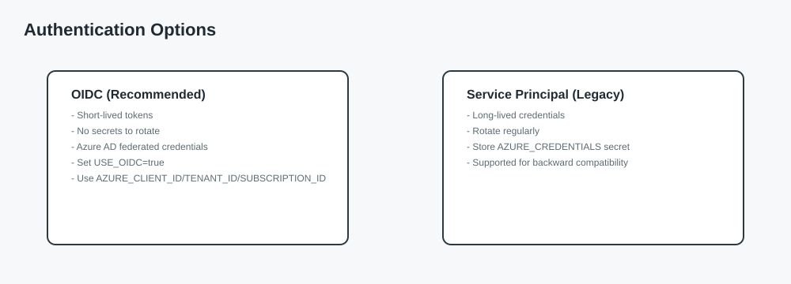

# Getting Started

This guide walks through the minimum setup required to run the unified Terraform pipeline against your Azure subscription.

## Prerequisites

- Azure subscription with Owner or Contributor access
- Azure CLI installed locally (`az --version`)
- GitHub repository with Actions enabled

## Authentication options



### Option A: OIDC (recommended)

1. Create an Azure AD application and service principal.
2. Configure federated credentials for your GitHub repo.
3. Add repository variables:
   - `AZURE_CLIENT_ID`
   - `AZURE_TENANT_ID`
   - `AZURE_SUBSCRIPTION_ID`
   - `USE_OIDC=true`

### Option B: Service principal (legacy)

1. Create a service principal with `Contributor` permissions.
2. Add a repository secret:
   - `AZURE_CREDENTIALS` (full JSON from `az ad sp create-for-rbac --sdk-auth`)

## State storage

Terraform state requires Azure Storage. Create:

- Resource group (e.g., `rg-terraform-state`)
- Storage account
- `tfstate` container
- `tfstate-backups` container

See [.github/SETUP.md](../.github/SETUP.md) for PowerShell and Bash scripts.

## Required GitHub secrets

| Secret | Description |
|--------|-------------|
| `TF_STATE_RG` | Resource group for the state storage account |
| `TF_STATE_SA` | Storage account name |
| `AZURE_CREDENTIALS` | Service principal JSON (legacy only) |
| `INFRACOST_API_KEY` | Infracost API key (optional) |

## Required GitHub variables (OIDC)

| Variable | Description |
|----------|-------------|
| `AZURE_CLIENT_ID` | Azure AD application client ID |
| `AZURE_TENANT_ID` | Azure AD tenant ID |
| `AZURE_SUBSCRIPTION_ID` | Azure subscription ID |
| `USE_OIDC` | Set to `true` |

## First run

1. Open **Actions** in GitHub.
2. Select **Terraform Pipeline**.
3. Run the workflow with:
   - `mode`: `single`
   - `environment`: `lab` (or another non-prod environment)
   - `action`: `plan`

## Optional variables

You can enable additional stages by setting repository variables. See [Pipeline Stages](Pipeline-Stages.md) for details.

## Local testing

If you want to validate Terraform locally before pushing:

```bash
terraform fmt -recursive
terraform init
terraform validate
terraform plan -var-file=environments/lab.tfvars
```

_Last updated: January 2026_
