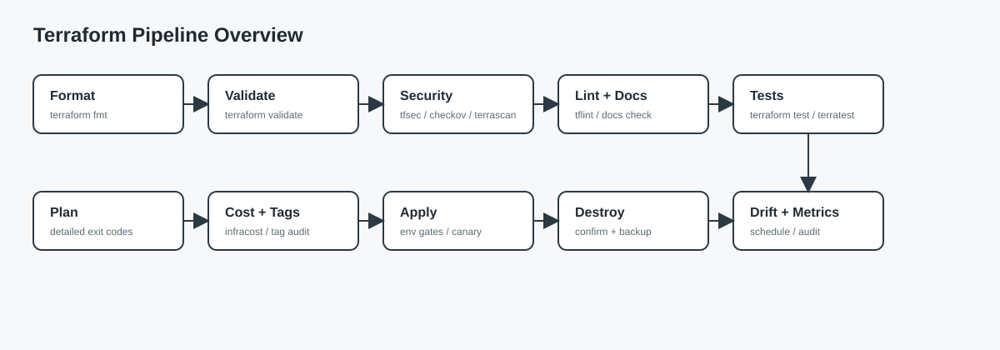
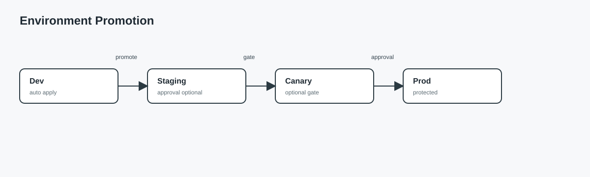
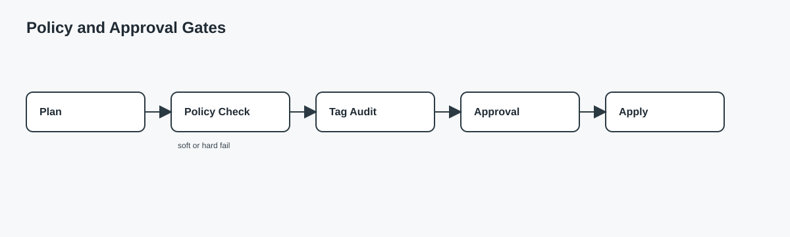
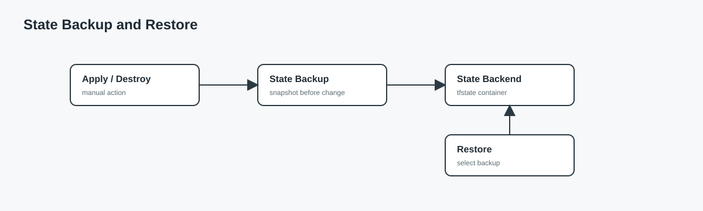
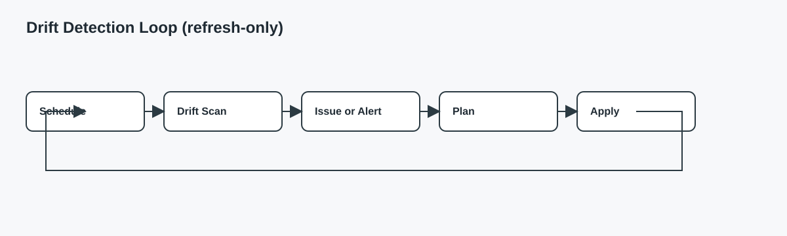

# Pipeline Stages

This page describes the stages in the unified pipeline (`.github/workflows/terraform.yml`). Stages are grouped by lifecycle and may be optional based on repository variables.

## Stage map

## Gates and flows

## Core stages

| Stage | Job | Purpose |
|------|-----|---------|
| 0 | `router` | Determines mode (single, matrix, drift) |
| 1 | `format` | Enforces `terraform fmt` |
| 2 | `validate` | Runs `terraform validate` |
| 3 | `security-tfsec` | tfsec scan (soft fail) |
| 3 | `security-checkov` | Checkov scan (soft fail) |
| 3 | `secret-scan` | Gitleaks scan (soft fail by default) |
| 3 | `shellcheck` | Shell script lint for composite actions |
| 4 | `tflint` | Terraform lint with Azure ruleset |
| 4 | `policy-check` | Conftest/OPA policy checks |
| 4 | `terraform-docs` | Generates docs artifacts |
| 5 | `graph` | Dependency graph output |
| 5 | `module-versions` | Provider/module version report |
| 6 | `cost-estimate` | Infracost summary (single mode only) |
| 6 | `version-check` | Terraform/provider update checks |
| 7 | `plan` | Terraform plan output and PR comment (single mode only) |
| 8 | `apply` | Apply in single mode (auto on push unless `AUTO_APPLY=false`) |
| 9 | `destroy` | Destroy in single mode (manual) |
| 10 | `metrics` | Post-apply metrics and audit summary (single mode only) |
| 11 | `compliance-report` | Compliance report after successful apply |

## Optional stages (enable with variables)

| Stage | Job | Enable variable | Notes |
|------|-----|-----------------|-------|
| 0 | `repo-hygiene` | `ENABLE_REPO_HYGIENE=true` | Checks branch protection settings |
| 2 | `terraform-tests` | `ENABLE_TERRAFORM_TESTS=false` to disable | Runs `terraform test` if .tftest files exist |
| 2 | `module-contracts` | `ENABLE_MODULE_CONTRACTS=true` | Checks module docs and variable descriptions |
| 3 | `security-terrascan` | `ENABLE_TERRASCAN=true` | Terrascan SARIF upload |
| 4 | `docs-check` | `DOCS_ENFORCE=true` | Fails if terraform-docs output changed |
| 4e | `azure-policy-check` | `ENABLE_AZURE_POLICY_CHECK=true` | Azure Policy compliance pre-check |
| 5b | `blast-radius` | `ENABLE_BLAST_RADIUS=true` | Visual blast radius analysis |
| 5c | `dependency-map` | `ENABLE_DEPENDENCY_MAP=true` | Resource dependency mapping |
| 7 | `tag-audit` | `REQUIRED_TAG_KEYS` set | Verifies required tag keys in plan |
| 7 | `integration-tests` | PR only | Terratest execution (soft fail) |
| 7 | `canary` | `ENABLE_CANARY=true` and prod target | Canary apply before prod apply |
| 7 | `ephemeral-env` | `ENABLE_EPHEMERAL_ENV=true` | PR-only ephemeral apply + destroy |
| 7e | `dependency-health-check` | `ENABLE_DEPENDENCY_CHECK=true` | External dependency health verification |
| 7f | `quota-validation` | `ENABLE_QUOTA_CHECK=true` | Azure quota validation before deploy |
| 10a | `health-check` | `ENABLE_HEALTH_CHECK=true` | Post-deployment health probes |
| 10b | `e2e-tests` | `ENABLE_E2E_TESTS=true` | E2E smoke tests after apply |
| 10c | `performance-baseline` | `ENABLE_PERFORMANCE_BASELINE=true` | Capture performance metrics |
| 11a | `sbom` | `ENABLE_SBOM=true` | Software Bill of Materials generation |
| 12 | `auto-rollback` | `ENABLE_AUTO_ROLLBACK=true` | Auto-rollback on health check failure |

## Why stages are skipped

- Mode-specific jobs only run in their mode (single vs matrix vs drift).
- Apply runs on manual dispatch or on push unless `AUTO_APPLY=false`; destroy remains manual with `action=destroy`.
- PR-only jobs run only on pull requests (integration tests, ephemeral env).
- Optional jobs require their enable variables to be set.

## Mode-specific stages

### Matrix mode

- `matrix-plan`
- `matrix-apply-dev`
- `matrix-apply-staging`
- `matrix-apply-prod`
- `matrix-notify`

### Drift mode

- `drift-detect`
- `drift-notify`

## Apply and destroy gates

- `apply` runs on manual dispatch with `action: apply` or on push unless `AUTO_APPLY=false`.
- `destroy` requires manual dispatch with `action: destroy` and `destroy_confirm: DESTROY`.
- Environment protection rules can add approvals.
- Change freeze windows are enforced if `ENABLE_FREEZE_WINDOW=true`.

_Last updated: January 2026_
